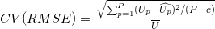
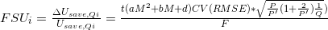
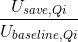
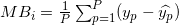
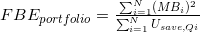

# CalTRACK Methods Documentation
(Version 2.0)

## Section 1: Overview

### 1.1. Introduction

> **1.1.1.:** CalTRACK is a set of methods for estimating avoided energy use (AEU), related to the implementation of one or more energy efficiency measures, such as an energy efficiency retrofit or a consumer behavior modification. CalTRACK methods yield whole building, site-level savings outputs. Portfolio-level savings confidence is measured by aggregating the performance of a number of individual sites and calculating portfolio fractional savings uncertainty. The primary CalTRACK use case is energy efficiency procurement (such as Pay-for-Performance and Non-Wires Alternatives). As such, key considerations are replicability and availability of data. The methods described in this document require only commonly-available site-level meter and weather data.

> **1.1.2.** CalTRACK methods will be familiar to energy efficiency measurement and verification (M&V) practitioners and program evaluators (EM&V). These methods are similar to ASHRAE Guideline 14, IPMVP Option C, and the Uniform Methods Project (UMP). In addition to a long history of use in project and program evaluation, these approaches draw on a methodological foundation developed in the more general statistical literature on piecewise linear regression or segmented regression for policy analysis and effect estimates that is used in fields as diverse as public health, medical research, and econometrics.

> **1.1.3.** CalTRACK methods are developed through a consensus process, organized as a series of “sprints” and versioned (e.g., 1.0, 2.0, etc.). Older versions are archived for reference, but new versions should be considered to reflect the consensus guidance of the working group. As a rule, CalTRACK methods are designed to inform a technical audience of practitioners, however, where useful, a pragmatic effort is made to provide specific policy guidance when doing so facilitates reproducibility.

> **1.1.4.** In the methodological appendix, this document also references more detailed descriptions of testing procedures and alternative approaches that have already or have not yet been tested. In all cases, the CalTRACK technical working group has sought to justify technical and procedural choices using referenceable and reproducible empirical analysis.

> **1.1.5.** This is a “living” document, in the sense that the working group continues to meet to propose, test, discuss, and enact changes to the methods. As such, recommendations may change as additional evidence arises supporting new approaches or challenging current approaches. The CalTRACK methods are version controlled to allow users to pin their programs, policies, or analysis to a particular instantiation of the methods. However, given that the latest version will always reflect what the working group believes to be the most complete and well-tested approaches, users of the CalTRACK methods are encouraged to create policies which make room for continued incorporation of methodological improvements.

> **1.1.6.** To further assist with referenceability and versioning, this document provides a numbering scheme to facilitate referencing the methods. As the numbering scheme may change as the methods are tested and refined, it should should be used in combination with a document version to prevent ambiguity.

> **1.1.7.** The CalTRACK methods are designed to be general enough to implement using any general-purpose programming language and are not required to be deployed with any particular software implementation. To the extent that code samples do appear in this document, they are intended as to be used as pseudo-code.

### 1.2. Participation in methods development

> **1.2.1.** The technical working group meetings are open to all and technical contribution is highly encouraged. Efforts to propose changes which are in-scope (see 1.3.2), and empirically and replicably tested will generally be met with interest and engagement. Efforts to propose changes which are out-of-scope (see 1.3.3), are discouraged.

> **1.2.2.** Ongoing discussions within the technical working group can be followed in the CalTRACK Github Issues section, which should reference particular proposed changes to this document. These are also noted and linked where applicable in this document

> **1.2.3.** Interested parties may sign up to participate in the CalTRACK technical working group proceedings by registering at http://www.caltrack.org.

### 1.3. Scope

> **1.3.1.** Some items have been considered to be generally in-scope for CalTRACK methods development.

>> **1.3.1.1.** Technical clarifications or improvements to existing methods.

>> **1.3.1.2.** Methods for calculating uncertainty or establishing criteria for use cases.

>> **1.3.1.3.** Empirical tests to evaluate methodological choices and assumptions.

> **1.3.2.** Some items have, to date, been considered out-of-scope for CalTRACK methods development.

>> **1.3.2.1.** Pooled analysis.

>> **1.3.2.2.** Data sources which prove to be impossible to entirely standardize, such as measures performed.

>> **1.3.2.3.** Measure attribution.

>> **1.3.2.4.** Programming language or implementation-specific constraints.

>> **1.3.2.5.** Proprietary, closed-source, or restrictively-licensed algorithms, procedures, or content.

>> **1.3.2.6.** Analysis or evidence based in datasets which cannot be otherwise replicated by working group members.
 
 
### 1.4. Definitions

> **1.4.1.** Project. An event, action, or set of measures implemented which is expected to have some effect on building energy consumption, such as a retrofit, performance or installation of a measure, or a behavioral intervention.

> **1.4.2.** Baseline period. A period of time during which data is gathered to calculate the relationship between metered consumption and weather conditions prior to a project.

> **1.4.3.** Reporting period. A period of time during which data is gathered to calculate the metered consumption and weather conditions following a project.

> **1.4.4.** Intervention period. A period of time between the end of the baseline period and the beginning of the reporting period in which a project is being installed. The intervention period is typically removed from the analysis because of erratic energy use during project installation. If a behavior intervention, the intervention period is typically one day. If multiple project dates are given, e.g., for multiple measure installations, use the earliest intervention date as project start date and the latest date as the project completion date. Recommend flagging for review if dates are more than one year apart.

> **1.4.5.** Avoided Energy Use. The difference between: Energy use predictions derived from a baseline energy model in conjunction with weather data during the reporting period; and Actual energy use observed in a reporting period.

> **1.4.6.** Procurer. The party that buys energy savings stemming from energy efficiency interventions, usually a utility.

> **1.4.7.** Aggregator. The party that supplies energy savings projects to a procuring entity and generally takes on the associated performance risk.

> **1.4.8.** Site. An endpoint on the grid where energy consumption is monitored by one or more physical meters.

> **1.4.9.** Energy consumption. A value derived from a physical meter based on the amount delivered over particular intervals of time.

## Section 2: Data Management

### 2.1. Data Inputs
The data requirements to apply CalTRACK methods to a single metered site are listed in this section. These represent the “ideal”. Additional constraints and sufficiency requirements follow in section (2.2) and considerations for handling missing or incomplete data follow.

> **2.1.1.** Energy consumption data (meter data). This data must have the following qualities.

>> **2.1.1.1.** Periods of usage, usage during those periods. Can be provided as billing data or as AMI data.

>> **2.1.1.2.** May be combined from multiple sources or accounts.

>> **2.1.1.3** Must be converted to units of energy consumption, not supplied volume. This can be achieved, for example, by using a therm factor conversion.

>> **2.1.1.4.** Must be subject to the constraints outlined in 2.2.

>> **2.1.1.5.** Flag or directional indicator for presence of net metering.

> **2.1.2.** Set of candidate weather station sites. Each weather station should have the following data available

>> **2.1.2.1.** Weather station site latitude and longitude coordinates

>> **2.1.2.2.** Climate zones information if needed in weather station matching (see 2.4).

>> **2.1.2.3.** IECC Climate Zone

>> **2.1.2.4.** IECC Moisture Regime

>> **2.1.2.5.** Building America Climate Zone

>> **2.1.2.6.** California Building Climate Zone Area (if site is in the state of California)

>> **2.1.2.7.** Observed dry-bulb temperature data, subject to the data requirements outlined in 2.2.

> **2.1.3.** Project data

>> **2.1.3.1.** Date(s).

>>> **2.1.3.1.1.** Project start date. The date of the beginning of the intervention period (see 1.4.4) during which energy use will be ignored. If the exact start date is not known, an estimate may be used in place of a recorded start date. The estimate should err on the side of an earlier start date.

>>> **2.1.3.1.2.** Intervention completion date. The date of the end of the intervention period. This date marks the beginning of the reporting period (see 1.4.3). If the exact completion date is not known, an estimate may be used in place of a recorded completion date. The estimate should err on the side of a later start date.

>>> **2.1.3.1.3.** For a behavioral intervention, use a common project start and intervention completion date when behavioral intervention(s) become or became active.

>> **2.1.4.** Building site data.

>> **2.1.4.1.** Latitude and longitude coordinates. Should be four decimal places or more.

>>> **2.1.4.1.1.** In the absence of a high quality geocode, the latitude and longitude coordinates of the centroid of the ZIP Code Tabulation Area (ZCTA) may be used instead. ZCTA should be used in preference to ZIP code, as ZIP codes are not associated with geographic boundaries (see https://www.census.gov/geo/reference/zctas.html).

> **2.1.5.** Climate zone (see 2.1.2.2)

> **2.1.6.** Time zone

## 2.2. Data constraints for modeling

> **2.2.1.** Missing values and data sufficiency for baseline period

>> **2.2.1.1.** Consumption and temperature data should be sufficient to allow for a 365 day baseline period.

>> **2.2.1.2.** Number of days of consumption and temperature data missing should not exceed 37 days (10%).

>> **2.2.1.3.** Data is considered missing if it is clearly marked by the data provider as NULL, NaN, or similar.

>> **2.2.1.4.** Values of 0 are considered missing for electricity data, but not gas data.

> **2.2.2.** Daily data is considered sufficient for baseline period under the following conditions:

>> **2.2.2.1.** If summing to daily usage from higher frequency interval data, no more than 50% of high-frequency values should be missing. Missing values should be filled in with average of non-missing values (e.g., for hourly data, 24 * average hourly usage).

>> **2.2.2.2.** Although this is more common in billing data than in interval data, if periods are estimated they should be combined with subsequent periods.

>> **2.2.2.3.** If daily average temperatures are calculated by averaging higher frequency temperature data, no more than 50% of high-frequency temperature values should be missing.

> **2.2.3.** Billing data is considered sufficient for baseline period under the following conditions:

>> **2.2.3.1.** Estimated periods values should be combined with next period up to a 70 day limit. Estimated periods are counted as missing data for the purpose of determining data sufficiency to limit the number of estimated reads used for analysis.

>> **2.2.3.2.** If average temperatures for billing periods are calculated by averaging higher frequency temperature data, the high-frequency temperature data must cover 90% of each averaged billing period.

>> **2.2.3.3.** If daily average temperatures are calculated by averaging higher frequency temperature data, no more than 50% of high-frequency temperature values should be missing.

>> **2.2.3.4.** Off-cycle reads (spanning less than 25 days) should be dropped from analysis. These readings typically occur due to meter reading problems or changes in occupancy.

>> **2.2.3.5.** For pseudo-monthly billing cycles, periods spanning more than 35 days should be dropped from analysis. For bi-monthly billing cycles, periods spanning more than 70 days should be dropped from the analysis.

> **2.2.4.** Data spanning beyond the period should not be used in analysis.

> **2.2.5.** Projects should be excluded if net metering (i.e., for photovoltaics or other on-site generation) status changes during the baseline period.

>> **2.2.5.1.** Exception: Future efforts may provide the ability to access sub-meter data that may allow for backing out onsite generation and storage to arrive at savings. Currently, this data is not readily obtained.

> **2.2.6.** Projects should be flagged if electric vehicle charging is installed during the baseline period.

## 2.3. Guidelines for handling data quality issues
In many cases, data quality issues can be resolved by going back to the source to resolve issues in export or transfer. This guidance is a second line of defense for handling or correcting for common data issues, and are provided in the hope of mitigating the myriad issues and discrepancies which arise using different methods for data cleaning.

> **2.3.1.** Impossible dates.

>> **2.3.1.1.** If conducting billing analysis, and if day of month is impossible (e.g., 32nd of Jan), use first of month.

>> **2.3.1.2.** If month (e.g., 13) or year (e.g. 2051) is impossible flag the date and remove it from the dataset. Check for mis-coding, such as 2015 -> 2051.

> **2.3.2.** Duplicated meter or temperature records

>> **2.3.2.1.** Combine available versions into a single time series by dropping duplicate records, using the most complete version possible. If a record for a particular timestamp conflicts with another version, flag the project for possible existence of multiple meters or submeters. If this is confirmed, the usage from multiple meters may be aggregated.

> **2.3.3** Ensure that meter and temperature data is using matching and correct timezone and daylight-savings handling across all data sources

> **2.3.4.** NOAA weather is sampled roughly hourly with minute-level timestamps. This should be converted to hourly by first computing a minute-resolution time series using near interpolation of data points with a limit of 60 minutes, then downsampling to hourly temperature by taking mean of linearly-interpolated minute-level readings.

> **2.3.5**. Negative meter data values should be flagged for review as they indicate the possible unreported presence of net metering.

> **2.3.6.** Extreme values: Usage values that are more than three interquartile ranges larger than the median usage should be flagged as outliers and manually reviewed.

> **2.3.7.** Generally recommend an audit for dataset completeness using expected counts of sites, meters, and projects.

> **2.3.8.** Roll up data if not given with expected frequency.

## 2.4. Matching a site to a weather station

> **2.4.1.** Weather station to be used is closest within climate zone that meets CalTrack data sufficiency requirements.

>> **2.4.1.1.** If there are no weather stations within that climate zone, fallback to closest weather station that has complete data.

> **2.4.2.** Matches further than 200 km should be flagged for review, as these distant matches may sacrifice interpretability of the model.

# Section 3: Modeling

## 3.1. Overview of usage per day model strategy.

> **3.1.1.** Model intuition.

>> **3.1.1.1.** Building is modeled as base load, heating load, and cooling load. Heating load and cooling load are assumed to have a linear relationship with heating and cooling demand, as approximated by heating and cooling degree days, beyond particular heating and cooling balance points.

> **3.1.2.** Model foundations in literature. Modeling does not strictly adhere to these methods, but draws from them for inspiration.

>> **3.1.2.1.** PRISM

>> **3.1.2.2.** Uniform Methods Project for Whole Home Building Analysis

>> **3.1.2.3.** California Evaluation Project

> **3.1.3.** Models are fit to baseline data in the 365 days immediately prior to the intervention start date, provided the data sufficiency criteria are met.

> **3.1.4.** Follow the process outlined below and detailed in subsequent sections.

>> **3.1.4.1.** Select and qualify balance points for candidate models for each period for each meter.

>> **3.1.4.2.** Use hourly temperature from the matched weather station (11).

>> **3.1.4.3.** Compute design matrixes, fit, and qualify all candidate models.

>> **3.1.4.4.** Select best candidate model.

>> **3.1.4.5.** Compute estimated values.

>> **3.1.4.6.** Compute measured values.

>> **3.1.4.7.** Compute savings.

>> **3.1.4.8.** Aggregate across sites.

## 3.2. Select and qualify balance points.

> **3.2.1.** A grid search of models is performed using a wide range of candidate balance points.

>> **3.2.1.1.** Recommended cooling balance point range is from 30 to 90 degrees F. For analysis of natural gas consumption, models using cooling degree days are not considered.

>> **3.2.1.2.** Recommended heating balance point range is from 30 to 90 degrees F.

> **3.2.2.** Constraints and qualification. Only model balance points or balance point combinations for which:

>> **3.2.2.1.** Cooling balance point >= heating balance point.

>> **3.2.2.2.** Have enough numbers of non-zero degree days. This is in order to avoid overfitting in the case where only a few days exist with usage and nonzero degree-days, and the usage happens by chance to be unusually high on those days.

>>> **3.2.2.2.1.** At least 10 days with non-zero degree days per year

>>> **3.2.2.2.2.** At least 20 degree days per year

> **3.2.3.** Maximum gap between candidate balance points in the grid search is 3 degrees F or the equivalent in degrees C.

## 3.3. Computing design matrix for each model.

> **3.3.1.** Basic structure applies to analysis using both daily and billing periods.

>> **3.3.1.1.** Dependent variable: average usage per day for a usage period.

>> **3.3.1.2.** Independent variables:

>>> **3.3.1.2.1.** Average cooling degree days per day for a usage period

>>> **3.3.1.2.2.** Average heating degree days per day for a usage period.

>> **3.3.1.3.** Fitted model parameters.

>>> **3.3.1.3.1.** *μ* intercept (interpreted as daily base load)

>>> **3.3.1.3.2.** βH is the slope

>>> **3.3.1.3.3.** βC is the slope

> **3.3.2.** Equation: UPD*p,i* = μ + β*H,i**HDD*p* + β*C,i**CDD*p* + ε*p,i*, where:

>> **3.3.2.1.** UPD*p,i* is average use (gas in therms, electricity in kWh) per day during period *p* for site *i*.

>> **3.3.2.2.** μ is the mean use for site *i*, or intercept.

>> **3.3.2.3.** β*H,i* is the heating coefficient for site *i*. It represents the incremental change in energy use per day for every additional heating degree day.

>> **3.3.2.4.** β*C,i* is the cooling coefficient for site *i*. It represents the incremental change in energy use per day for every additional cooling degree day.

>> **3.3.2.5.** HDD*p* is the average number of heating degree days per day in period *p*, which is a function of the selected balance point temperature, the average daily temperatures from the weather station matched to site *i* during the period *p*, and the number of days in period *p* with matched usage and weather data for site *i*.

>> **3.3.2.6.** CDD*p* is the average number of cooling degree days per day in period *p*, which is a function of the selected balance point temperature, the average daily temperatures from the weather station matched to site *i* during the period *p*, and the number of days in period *p* with matched usage and weather data for site *i*.

>> **3.3.2.7.** n is the site specific random error term for a given period.

> **3.3.3.** Computing average usage per day (UPD) for each period.

>> **3.3.3.1.** UPD*p* = 1&frasl;n*p* * Σ(U*d*), where

>> **3.3.3.2.** UPD*p* is the average use per day for a given period *p*

>> **3.3.3.3.** Σ(U*d*) is the sum of all daily use values U*d* for a given period *p*

>> **3.3.3.4.** n*p* is the total number of days for which daily use values U*d* were available in period *p*

>> **3.3.3.5.** Boundaries between days should occur at midnight of the local time zone.

> **3.3.4.** Cooling degree days for each particular balance point.

>> **3.3.4.1.** CDD values are calculated as follows:

>>> **3.3.4.1.1.** CDD*p* = 1&frasl;n*d,p* * Σ(max(avg(T*d*) - CDD*b*, 0)), where

>>> **3.3.4.1.2.** CDD*p* = Cooling degree days for period *p*

>>> **3.3.4.1.3.** CDD*b* = the CDD balance point that provides best model fit

>>> **3.3.4.1.4.** n*d,p* is the total number of days elapsed between the start time of the period *p* and the end time of the period *p*

>>> **3.3.4.1.5.** Σ() = the sum of values in () over each day *d* in period *p*

>>> **3.3.4.1.6.** max() = the maximum of the two values in ()

>>> **3.3.4.1.7.** avg(T*d*) = the average temperature for day *d*

> **3.3.5.** Heating degree days for each particular balance point.

>> **3.3.5.1.** HDD values are calculated as follows:

>>> **3.3.5.1.1.** HDD*p* = 1&frasl;n*d,p* * Σ(max(HDD*b* - avg(T*d*), 0)), where

>>> **3.3.5.1.2.** HDD*p* = Average heating degree days per day for period *p*

>>> **3.3.5.1.3.** HDD*b* = the HDD balance point that provides best model fit

>>> **3.3.5.1.4.** n*d,p*  is the total number of days elapsed between the start time of the period *p* and the end time of the period *p*

>>> **3.3.5.1.5.** Σ() = the sum of values in () over each day *d* in period *p*

>>> **3.3.5.1.6.** max() = the maximum of the two values in ()

>>> **3.3.5.1.7.** avg(T*d*) = the average temperature for day *d*

## 3.4. Fit candidate models

> **3.4.1.** Models using daily data are fit using ordinary least squares.

> **3.4.2.** Models using billing data are fit using weighted least squares regression. Use the corresponding number of days n*p* as the weight for each billing period.

> **3.4.3.** For each meter at each site, the choice must be made between using one of the single parameter models (just HDD or CDD) or combined models (HDD and CDD). This choice is called model selection. A range of candidate models is fitted for each qualified balance point, then the most appropriate single qualified model, as estimated using the metric below, is used to calculate estimated quantities.

>> **3.4.3.1.** Given the selected balance point ranges, all combinations of candidate balance points are tried. Models are as follows:

>>> **3.4.3.1.1** HDD and CDD (electricity only): UPD*p,i* = μ*i* + β*H,i**HDD*p* + β*C,i**CDD*p* + ε*p,i*

>>> **3.4.3.1.2.** HDD only: UPD*p,i* = μ*i* + β*H,i**HDD*p* + ε*p,i*

>>> **3.4.3.1.3.** CDD only: (electricity only: UPD*p,i* = μ*i* + β*C,i**CDD*p*+ ε*p,i*)

>>> **3.4.3.1.4.** intercept-only: UPD*p,i* = μ*i* + ε*p,i*. In this case, adjusted R-squared is 0 by definition.

>> **3.4.3.2.** Candidate model qualification. If each parameter estimate is not negative, then the model qualifies for inclusion in model selection.

>>> **3.4.3.2.1.** β*H* > 0

>>> **3.4.3.2.2.** β*C* > 0

>>> **3.4.3.2.3.** μ*i* > 0

>> **3.4.3.3.** The model with highest adjusted R-squared will be selected as the *final model*. Adjusted R-squared will be defined as:

>>> **3.4.3.3.1.** R2adj = 1 - ((SS*res*&frasl;df*e*) / (SS*tot*&frasl;df*t*)), where

>>> **3.4.3.3.2.** SS*res* is the sum of squares of residuals

>>> **3.4.3.3.3.** df*e* is the degrees of freedom of the estimate of the underlying population error variance, and is calculated using (*P - c - 1*), where *P* is the number of periods (e.g. days or billing periods) in the baseline used to estimate the model and *c* is the number of explanatory variables, not including the intercept term.

>>> **3.4.3.3.4.** SS*tot* is the total sum of squares

>>> **3.4.3.3.5.** df*t* is the degrees of freedom of the estimate of the population variance of the dependent variable, and is calculated as (*P - 1*), were *P* is the number of periods (e.g. days or billing periods) in the baseline used to estimate the model.

## 3.5 Missing Data in Reporting Period

> **3.5.1.** Missing temperature values and data sufficiency for reporting period

>> **3.5.1.1.** If a day is missing a temperature value, the corresponding consumption value for that day should be masked.

>> **3.5.1.2.** If daily average temperatures are calculated by averaging higher frequency temperature data, no more than 50% of high-frequency temperature values should be missing.

>> **3.5.1.3.** Missing values should be filled in with average of non-missing values (e.g., for hourly data, average hourly temperature)

>> **3.5.1.4.** Data is considered missing if it is clearly marked by the data provider as NULL, NaN, or similar.

> **3.5.2.** Missing consumption values and data sufficiency for reporting period

>> **3.5.2.1.** If a day is missing a consumption value, the corresponding counterfactual value for that day should be masked.

>> **3.5.2.2.** Data is considered missing if it is clearly marked by the data provider as NULL, NaN, or similar.

>> **3.5.2.1.** Values of 0 are considered missing for electricity data, but not gas data.

> **3.5.3.** Estimating counterfactual usage when temperature data is missing

>> **3.5.3.1.** Counterfactual usage is not calculated when daily temperature data is missing, pending further methodological discussion.

> **3.5.4.** Estimating avoided energy usage when consumption data is missing

>> **3.5.4.1.** Avoided energy use is not calculated when consumption data is missing.

> **3.5.5.** Billing data in the reporting period

>> **3.5.5.1.** Estimated periods values should be combined with next period up to a 70 day limit.

>> **3.5.5.2.** If average temperatures for billing periods are calculated by averaging higher frequency temperature data, the high-frequency temperature data must cover 90% of each averaged billing period.

>> **3.5.5.3.** Off-cycle reads (spanning less than 25 days) should be combined with next period up to a 70 day limit. These readings typically occur due to meter reading problems or changes in occupancy.

>> **3.5.5.4.** For monthly billing cycles, periods spanning more than 35 days should be flagged for review. For bi-monthly billing cycles, periods spanning more than 70 days should be flagged for review.

> **3.5.6.** Projects should be excluded if net metering (i.e., for photovoltaics or other on-site generation) status changes during the reporting period.

>> **3.5.6.1.** Exception: Future efforts may provide the ability to access sub-meter data that may allow for backing out onsite generation and storage to arrive at savings. Currently, this data is not readily obtained.

## 3.6. Computing derived quantities.

> **3.6.1.** Avoided energy use (AEU) for each time period in the reporting period is calculated as follows. 

>> AEU*p,i* = n*p* * (μ*i + β*H,i**HDD*p* + β*C,i**CDD*p* - UPD*p*).

>> **3.6.1.1.** The coefficients μ*i, β*H,i*, β*C,i* are those from the final model.

>> **3.6.1.2.** HDD*p* and CDD*p* are calculated using weather data in the reporting period according to guidelines in Section 3.3.

>> **3.6.1.3.** UPD*p* is the usage per day calculated for a period *p* using the same procedure as in Section 3.3.3.

# Section 4: Aggregation

## 4.1. Aggregating results for individual time periods

> **4.1.1.** In many cases, it may be desired to report results at an aggregated time scale (e.g. annual energy savings), rather than for specific time periods. This may be done by simply adding the period specific results. 

>> AEU*total,P* = Σ*P*p=1(AEU*p,i*)

> **4.1.2.** CalTRACK does not explicitly support annualizing results. For example, if avoided energy use AEU*total,8* is calculated for 8 monthly periods, then the annual savings cannot be estimated as AEU*total,12* = (AEU*total,8* * 12 / 8), as this may yield biased estimates for interventions that yield seasonal savings. However, at the discretion of the procurer, such values may be used for intermediate reporting.

## 4.2. Aggregating multiple site-level results

> **4.2.1.** Multiple site-level results may be aggregated by adding metered savings that occurred during the same time periods. 

> AEU*p,S* = Σ*S*i=1(AEU*p,i*)

## 4.3. Portfolio Uncertainty

> **4.3.1.** CalTRACK recommends approaching the uncertainty in avoided energy use on a case-by-case basis, depending on the objectives of the procurement or program.

> **4.3.2.** Portfolio use case.

>> **4.3.2.1.** For use cases where confidence in portfolio-level performance is required (e.g. aggregator-driven pay-for-performance, non-wires alternatives (NWA) procurements), a building-level Coefficient of Variation of the Root Mean Squared Error (CV(RMSE)) threshold of 100% is recommended as a default, but this requirement may be waived at the discretion of the procurer.

>> **4.3.2.2.** CV(RMSE) is calculated as follows: , where

>>> **4.3.2.2.1.** U*p* is the total measured energy use during period *p*

>>> **4.3.2.2.2.** Û is the predicted energy use during period *p*

>>> **4.3.2.2.3.** Ū is the mean energy use during the baseline period

>>> **4.3.2.2.4.** *P* is the total number of periods (e.g. days or billing periods) in the baseline used to estimate the model

>>> **4.3.2.2.5.** *c* is the number of explanatory variables in the baseline model (not including the intercept)

>> **4.3.2.3.** The portfolio-level fractional savings uncertainty (FSU) should be reported when using portfolio aggregation. Fractional savings uncertainty thresholds may be set by the procurer depending on the use case. For example, an NWA procurement may require less than 15% uncertainty, while a pay-for-performance program may require 25%. An alternative approach could use a discount rate based on the uncertainty of a portfolio.

>> **4.3.1.4.** Site-level FSU is calculated as follows using a modified version of the ASHRAE Guideline 14 formulation. , where

>>> **4.3.1.4.1.** FSU*i* is the fractional savings uncertainty in the baseline model predictions for the reporting period (this is also the fractional savings uncertainty of the avoided energy use, assuming that the metered consumption is accurate).

>>> **4.3.1.4.2.** *t* is the t-statistic, which is a function of the required confidence level (usually 90%) and the degrees of freedom of the baseline model (*P-c*)

>>> **4.3.1.4.3.** *M* is the number of months in the reporting period

>>> **4.3.1.4.4.** *Q* is the number of periods (e.g. days or billing periods) in the reporting period

>>> **4.3.1.4.5.** *F* is the savings fraction, defined as the energy savings during *q* periods in the reporting period divided by the predicted baseline usage during that same period: 

>>> **4.3.1.4.6.** *a*, *b* and *d* are empirical coefficients proposed by Sun and Baltazar [2013] to handle problems with autocorrelated residuals in time series energy use data.

>>>> For billing data, *a* = -0.00022, *b* = 0.03306, *d* = 0.94054.

>>>> For daily data, *a* = -0.00024, *b* = 0.03535, *d* = 1.00286.

>>> **4.3.1.5.** Site-level FSU from multiple projects can be aggregated to portfolio-level FSU as follows: .

>>> **4.3.1.6.** Bias. While aggregation can dramatically reduce portfolio-level savings uncertainty, it does not eliminate inherent systemic biases due to the use of non-linear models, implementation variance, imbalanced application of non-routine adjustments, unaccounted for independent variables, or population trends.

>>>> **4.3.1.6.1.** Portfolio-level bias from modeling should be reported using the fractional bias error defined as follows:

>>>>> Mean bias for a single site. .

>>>>> Portfolio-level bias error expressed as a percent of portfolio savings. .
